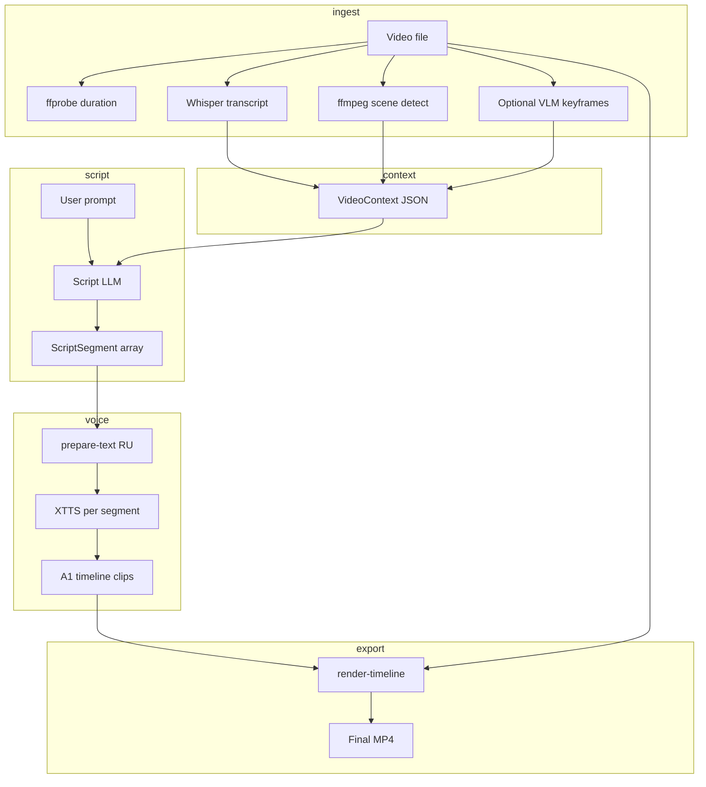

# Video Content Voiceover — Living Plan

> **Status:** Planned — separate development track  
> **Branch:** `feat/video-voiceover` (create when pronunciation track stabilizes)  
> **Updated:** 1 September 2026  
> **Depends on:** [VOICE_PRONUNCIATION_PLAN.md](VOICE_PRONUNCIATION_PLAN.md) (stress pipeline)  
> **Related:** [VIDEO_STUDIO_PLAN.md](VIDEO_STUDIO_PLAN.md), [AI_DIRECTOR.md](../ux/AI_DIRECTOR.md)

---

## Intent

User uploads **existing video** (screencast, recording, client file). The app:

1. **Understands** what is in the video (speech + scene structure + optional visuals).
2. **Generates a voiceover script** from the user's creative prompt (topic, tone, audience).
3. **Produces TTS** per segment with good Russian pronunciation (pronunciation track).
4. **Places audio on the timeline** aligned to video duration and scene boundaries.
5. **Exports** MP4 with new voiceover (optional: duck/replace original audio).

This is **not** generative video. It is **intelligent narration** over real footage — the workflow creators use for YouTube, course content, and product demos.

---

## What exists today (gaps)

| Step | Today | Gap |
|------|-------|-----|
| Upload video | ✅ From Recording, Director sources | No analysis metadata |
| Understand video | ❌ | Whisper, scene detect, optional VLM |
| Script from prompt | ⚠️ Template only (`planYoutubeVideo.ts`) | LLM + video context |
| TTS | ✅ XTTS + timeline parser | Needs pronunciation pipeline |
| Assembly | ✅ `render-timeline` | Auto-populate A1 from script |
| UI glue | ⚠️ `VideoTimelineCard` orphaned | New «From video» panel |

`voiceoverPromptFromPlan()` generates useless draft lines (repeats topic). `VideoTimelineCard.tsx` is complete but **not imported** in `VideoPage`.

---

## Target user flow (must ship in UI)

**Entry:** Video → **From video** (new tab alongside From scratch / From recording)

```
Upload video
    ↓
[Analyze]  — progress: transcribe · scenes · (optional) keyframes
    ↓
Analysis summary  — duration, scene list, transcript preview
    ↓
Prompt  — «Сделай озвучку как обзор для начинающих, дружелюбный тон»
    ↓
[Generate script]  — editable segment table (start, end, text)
    ↓
[Preview voice]  — per segment; pronunciation fix (see pronunciation plan)
    ↓
[Apply to timeline]  — A1 clips at timestamps
    ↓
[Export MP4]
```

Reference UX spec: [USER_FLOWS.md](../ux/USER_FLOWS.md) — Flow F (analysis) + Flow H (video voiceover).

---

## Pipeline architecture



### `VideoContext` (sidecar contract)

```json
{
  "duration_sec": 312.4,
  "transcript": {
    "segments": [{ "start": 0.0, "end": 4.2, "text": "..." }],
    "language": "ru"
  },
  "scenes": [{ "start": 0.0, "end": 45.3, "index": 0 }],
  "visual_notes": [{ "time": 12.0, "caption": "IDE with Angular code" }],
  "source_path": "/path/to/video.mp4"
}
```

`visual_notes` empty until VLM phase.

### `ScriptSegment` (LLM output)

```json
{
  "segments": [
    {
      "start_sec": 0,
      "end_sec": 12,
      "text": "В этом видео мы разберём...",
      "role": "hook"
    }
  ],
  "meta": { "tone": "friendly", "language": "ru", "words_per_min": 130 }
}
```

Constraints enforced in prompt + post-check: total spoken duration ≈ video duration; segment count ≈ scene count ±1.

---

## Backend modules (new)

| Module | Responsibility |
|--------|----------------|
| `sidecar/api/video_analyze.py` | `POST /api/video/analyze` |
| `sidecar/transcribe.py` | Whisper (MLX-Whisper or faster-whisper) |
| `sidecar/scene_detect.py` | ffmpeg `select=gt(scene,0.3)` + merge nearby cuts |
| `sidecar/api/script.py` | `POST /api/script/generate` |
| `sidecar/script_llm.py` | Local Ollama/MLX or cloud API adapter |
| Reuse `audio.py` | `prepare-text` + `tts` per segment |
| Reuse `video.py` | `render-timeline` |

### Analyze endpoint

`POST /api/video/analyze`

```json
{
  "video_path": "...",
  "options": {
    "transcribe": true,
    "scene_detect": true,
    "visual_captions": false
  }
}
```

Returns `VideoContext` + `job_id` for long runs. Store cache under `~/Documents/Canvas/Generated/Video/analysis/`.

### Script endpoint

`POST /api/script/generate`

```json
{
  "video_context": { ... },
  "prompt": "Обзор для YouTube, без воды",
  "language": "ru",
  "target_wpm": 130
}
```

---

## LLM options

| Option | When | Notes |
|--------|------|-------|
| **Cloud** (OpenAI / Claude / Gemini) | Fastest MVP | Settings API key; consent UX |
| **Local Ollama** | Privacy default | Qwen2.5 7B+; user installs separately |
| **MLX-LM** | Align with image stack | Future; not blocking MVP |

MVP recommendation: **pluggable provider** in Settings; ship cloud first for quality, local as opt-in.

---

## UI components (required)

| Component | Location | ID |
|-----------|----------|-----|
| `FromVideoPanel.tsx` | Video page new tab | V-VO-1 |
| `VideoAnalysisCard.tsx` | Progress + transcript/scene list | V-VO-2 |
| `VoiceoverScriptEditor.tsx` | Editable segments table | V-VO-3 |
| Wire or replace `VideoTimelineCard` | Apply script → timeline | V-VO-4 |
| i18n `ru.json` / `en.json` | All new strings | V-VO-5 |

**DirectorBoard** should open with A1 populated after «Apply to timeline».

---

## Phased delivery

| Phase | Scope | Outcome |
|-------|-------|---------|
| **1 — Analyze** | Whisper + scene detect, no LLM | User sees transcript + scenes |
| **2 — Script** | LLM generate + manual edit UI | Draft voiceover text with timings |
| **3 — Voice** | Integrate pronunciation + per-segment TTS | Listenable segments |
| **4 — Timeline** | Auto A1 + export | End-to-end MP4 |
| **5 — Visual** | Keyframe VLM captions in context | Better sync for silent screencasts |
| **6 — Replace mode** | Duck or mute original audio track | Product demo workflow |

**Branch strategy:**

- `feat/voice-pronunciation` — Phases 3 dependency (prepare-text, lexicon, fix UI).
- `feat/video-voiceover` — Phases 1–2–4–6; merge pronunciation track before Phase 3.

---

## Hardware & memory

| Job | RAM (est. M4) | Notes |
|-----|---------------|-------|
| Whisper medium | ~2 GB | Run exclusive of FLUX |
| Whisper large-v3 | ~4 GB | Better RU |
| XTTS segment | ~2 GB | Sequential per segment |
| LLM 7B local | ~6 GB | Optional |

**Rule:** Do not run analyze + image generation + TTS concurrently. Job queue or explicit «GPU busy» like image pipeline.

---

## Risks

| Risk | Mitigation |
|------|------------|
| Script too long/short vs video | WPM post-check; trim/expand pass in LLM |
| Ozvuchka не совпадает с экраном | Phase 5 VLM; MVP = topic narration not frame-accurate |
| Whisper wrong on technical terms | User edits transcript before script gen |
| XTTS stress errors | Pronunciation track + lexicon |

---

## Relation to AI Director (V2)

This track implements a **slice** of AI Director: brief + media → script → voice → export. Full Director adds dependency graph, multi-scene image gen, Shorts package. See [AI_DIRECTOR.md](../ux/AI_DIRECTOR.md).

When Director ships, `From video` becomes one **intent** inside Director; keep APIs (`analyze`, `script/generate`) as shared sidecar primitives.

---

## Code map (touch list)

| Path | Change |
|------|--------|
| `src/renderer/src/features/video/ui/VideoPage.tsx` | Add From video tab |
| `src/renderer/src/features/video/ui/FromVideoPanel.tsx` | New |
| `src/renderer/src/features/video/model/planYoutubeVideo.ts` | Deprecate for LLM script |
| `sidecar/api/video.py` | analyze route or sub-router |
| `sidecar/main.py` | Register routers |
| `src/main/index.ts` | IPC for analyze + script |

---

## Revision log

| Date | Note |
|------|------|
| 2026-09-01 | Initial plan: analyze → script → pronunciation TTS → timeline; branch `feat/video-voiceover` |
| 2026-09-02 | Phase 1 shipped: analyze API, FromVideoPanel, scene detect + optional Whisper |
