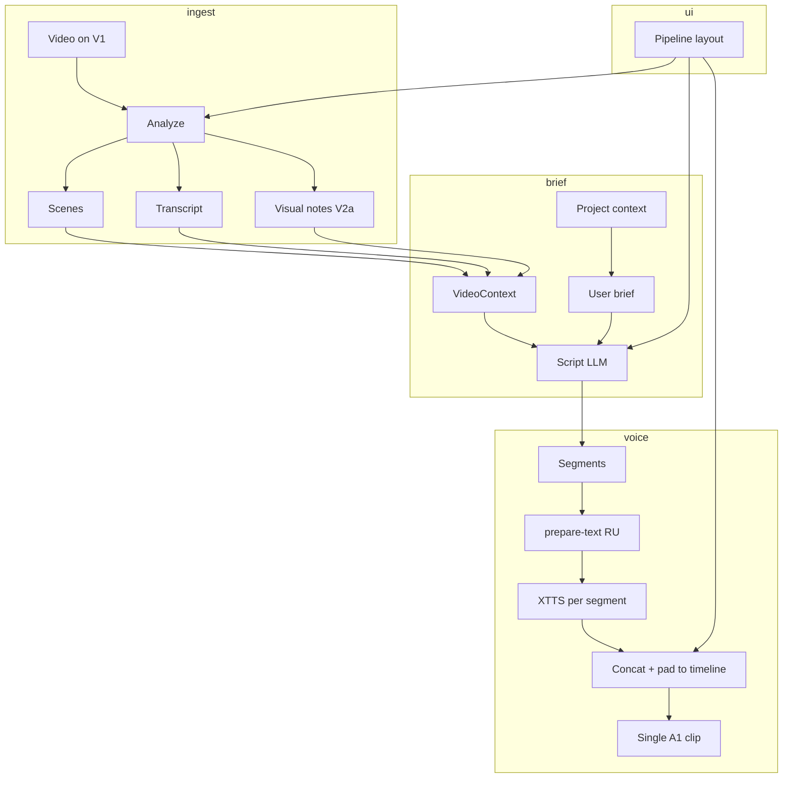

# Video Voiceover V2 — Vision & Handoff

> **Status:** Planning — branch `docs/voiceover-v2-vision`  
> **Author intent:** Product owner feedback, 2 Sep 2026  
> **Audience:** Next AI agents implementing UI/UX and intelligence upgrades  
> **Builds on:** [VIDEO_VOICEOVER_PLAN.md](VIDEO_VOICEOVER_PLAN.md), [VOICE_PRONUNCIATION_PLAN.md](VOICE_PRONUNCIATION_PLAN.md), [VIDEO_STUDIO_PLAN.md](VIDEO_STUDIO_PLAN.md)

---

## Executive summary

**V1 (shipped on `feat/video-voiceover`)** proves the technical chain: analyze → script → TTS → A1 → export. It works end-to-end but feels **raw, primitive, and scattered**.

**V2** is not “more buttons.” It is:

1. **Pipeline-first UX** — one focused center stage; panels appear/disappear by step.
2. **Video-aware intelligence** — model *sees* what happens on screen and narrates accordingly.
3. **Continuous voiceover** — speech that accompanies the full video track, not tiny disconnected A1 chunks.
4. **Project-grounded prompts** — user brief derived from their product/project study.
5. **Production pronunciation** — RU stress + lexicon integrated into the voiceover path.

---

## What V1 does today (baseline)

| Step | Implementation | Quality |
|------|----------------|---------|
| Analyze | ffmpeg scene detect + optional Whisper | OK for scenes; transcript often empty |
| Script | Ollama qwen2.5:7b or scene fallback | **Weak** — placeholder text per scene, not video content |
| Voice sample | Inline record / file / library in Sources | OK after UX fix |
| TTS | XTTS per segment → separate A1 clips | **Weak** — 4 short clips, gaps, no continuous narration |
| Layout | Grid + Free dock (timeline bottom, preview top-right) | **Poor** for voiceover workflow |
| Export | render-timeline | OK when V1 + A1 populated |

**User quote (paraphrased):** “More or less understandable how it works, but very raw and primitive. Everything is scattered. Scale at the bottom, video top-right. Text generated in small pieces and doesn’t accompany the video track.”

---

## V2 product goals

### G1 — Pipeline layout mode (default for voiceover)

Three layout modes for Video Studio:

| Mode | ID | When | Behavior |
|------|-----|------|----------|
| **Pipeline** | `pipeline` | Default when entering voiceover / “Озвучка” | Single **center stage**; only the current step’s UI is visible. Previous steps collapse to a summary strip. Future steps hidden. |
| **Grid** | `tile` | Power users, overview | Current behavior — Sources, Timeline, Result tiles. |
| **Free** | `free` | Manual arrangement | Current free dock — drag/resize panels. |

**Pipeline stages (center stage):**

```
1. Material    → video on timeline or pick from sources (compact)
2. Analyze     → progress + scene list (collapsible when done)
3. Brief       → user prompt + optional “project context” doc
4. Script      → editable segments synced to video timeline preview
5. Voice       → sample + “Generate voiceover” (one action)
6. Review      → preview with V1+A1, waveform, playhead sync
7. Export      → “Собрать MP4”
```

**Rules:**

- Entering voiceover from menu sets `layoutMode: pipeline` and focuses stage.
- Completed steps show as **checkmarks in a horizontal stepper** (top of center), not full panels.
- Timeline appears in stages 6–7 only (or as a thin strip in 4–5 with playhead).
- Preview is **beside or above** script during stages 4–6 — not orphaned top-right while controls are bottom-left.
- User can switch to Grid/Free anytime; pipeline state preserved.

See [VIDEO_STUDIO_LAYOUT_MODES.md](../ux/VIDEO_STUDIO_LAYOUT_MODES.md) for wire-level spec.

### G2 — Video-aware script generation

**Problem:** Script uses scene timestamps but **does not describe what is on screen**. Fallback text: “Scene 2: main part from this clip.” Ollama without visual context hallucinates generic intros.

**Target flow:**

```
Video file
    ↓
Analyze (existing)
    ├── scenes (ffmpeg)
    ├── transcript (Whisper, optional)
    └── visual_notes[]  ← NEW: per-scene or keyframe captions
            ↓
User brief + Project context  ← NEW: long-form prompt from product study
            ↓
LLM script generate
    ├── segment.text describes WHAT HAPPENS on screen at that time
    ├── segment.text follows user brief (e.g. client pitch for 3D store)
    └── total spoken duration ≈ video duration (WPM budget)
            ↓
Editable script table (unchanged UX, better content)
```

**Example brief (user):**

> Расскажи потенциальному клиенту о нашей модели интернет-магазина. Покажи 3D-вьюер, админку, процесс загрузки модели. Тон: уверенный, дружелюбный, B2B.

**Example segment (generated):**

| Time | Text |
|------|------|
| 0:00–2:02 | «Представьте интернет-магазин, где каждый товар — интерактивная 3D-модель. Сейчас вы видите витрину: покупатель крутит сумку и меняет цвет кожи.» |
| 2:02–2:35 | «В админ-панели менеджер загружает GLB, настраивает материалы и публикует карточку за минуту.» |

**Implementation phases:**

| Phase | Capability | Tech | Status |
|-------|------------|------|--------|
| V2a | Keyframe extract (1 per scene) + vision caption | ffmpeg + **Ollama vision model** (auto-detected: qwen2.5vl / llava / llama3.2-vision / minicpm-v / gemma3 / moondream…) | ✅ shipped 2 Sep 2026 — `sidecar/visual_caption.py`, wired into `video_analyze.py` (stage `visual`, cached with analysis; degrades to `VISION_MODEL_MISSING` warning) |
| V2b | `ProjectContext` — user pastes product doc | `voiceover.projectContext` in director session (persists across restarts); Brief stage UI | ✅ shipped 2 Sep 2026 |
| V2c | Script prompt uses `visual_notes` + `ProjectContext` + brief | `script_llm._build_llm_prompt` — per-scene “on screen: …” lines + “Project facts” block; caption-aware fallback replaces «Сцена N» placeholders | ✅ shipped 2 Sep 2026 |
| V2d | Post-check: segment count = scenes, coverage = duration | Already partial in V1 | partial |

**Contract extension (`VideoContext.visual_notes`):**

```json
{
  "time": 12.0,
  "scene_index": 0,
  "caption": "3D handbag on white background, color picker UI visible",
  "source": "vlm" 
}
```

### G3 — Continuous voiceover on A1

**Problem:** V1 calls XTTS **once per segment** → multiple short A1 clips with **silence between**. Sounds amateur; doesn’t “accompany” the video.

**Options (pick one for V2, document others):**

| Approach | Pros | Cons |
|----------|------|------|
| **A. Single merged WAV** | One A1 clip, full duration, simple preview | Hard to re-edit one sentence |
| **B. Segments + silence padding** | Per-segment edit retained | Complex timing; drift |
| **C. Segments + auto gap-fill** | TTS per segment, ffmpeg concat with timed silence to match `start_sec` | Re-edit friendly; one export clip |
| **D. Real-time stretch** | Match speech to scene length | Quality risk |

**Recommendation:** **C** for V2 — generate per segment (pronunciation per line), concat with `adelay`/padding to absolute timestamps, **one bin** on A1 at 0:00.

**UI change:** User sees one “Voiceover” clip on A1, not four “Озвучка N” fragments.

**Backend:** `POST /api/audio/tts/voiceover-track` — input: segments[], output: single wav + duration map for editor.

> ✅ **Shipped 2 Sep 2026 (option C).** Actual endpoint: `POST /api/audio/voiceover-track`
> (`sidecar/api/audio.py: mix_voiceover_track`). Per-segment XTTS stays (pronunciation
> per line); ffmpeg then unifies rate/layout (`aresample=48000` + mono), delays each part
> to its `start_sec` (`adelay`), mixes without loudness normalization (`amix normalize=0`,
> speech never overlaps), and pads with silence to the full video duration
> (`apad=whole_dur`). Renderer (`applyScriptVoiceover` in `DirectorBoard.tsx`) collects
> segment wavs, calls `window.api.mixVoiceoverTrack`, and places **one clip «Озвучка»**
> on A1 at 0:00 spanning the video. Falls back to per-segment placement if the mix API
> is unavailable. IPC: `mix-voiceover-track` in `src/main/index.ts` + preload bridge.

### G4 — Project context prompt

User wants to prepare a **master prompt from studying their project**, reused across videos.

**UX:**

- In pipeline stage **Brief**: textarea “Промпт для этого ролика” + optional “Контекст проекта” (loaded from Project settings or pasted).
- Store per-project: `~/Documents/Canvas/Projects/{id}/voiceover-context.md` (or SQLite).
- LLM system prompt: “You are narrating a product demo. Project facts: … User intent for this video: … Scene visuals: …”

**Not in scope for first V2 slice:** auto-scrape repo/website — manual paste is enough.

### G5 — Pronunciation in voiceover path

Reuse [VOICE_PRONUNCIATION_PLAN.md](VOICE_PRONUNCIATION_PLAN.md):

- Every segment → `prepare-text` → lexicon → XTTS (already wired in V1 per segment).
- **V2 add (✅ shipped 2 Sep 2026):** per-segment «Произношение» panel in the pipeline
  script table — spoken preview via `prepare-text` + inline fix («слово → как произнести»
  or «ударение на „а“») saved to the global lexicon via `POST /audio/lexicon/fix`.
  A successful fix resets voiceover status to `scripted` so A1 can be re-voiced.
- **V2 add (✅ shipped 2 Sep 2026):** speech-length estimate per segment
  (`words / WPM` vs scene window, warning on overflow) plus automatic tempo fit at mix time:
  `mix_voiceover_track` accepts `max_duration_sec` per part, applies ffmpeg `atempo` up to
  +20% so speech fits the scene window; measured duration and tempo shown in the script table
  after «Озвучить на A1».

---

## UX problems to fix (from screenshots)

| Issue | V2 fix |
|-------|--------|
| Timeline bottom, preview top-right, sources left | Pipeline mode: preview + script side-by-side in center |
| All dock panels visible at once | Pipeline hides irrelevant panels |
| “Сетка” / “Свободно” only in header | Add **“Пайплайн”** as third mode + default for voiceover entry |
| Script table far from preview | Stage 4 layout: 50/50 script + preview with playhead sync |
| 4 green A1 clips | Single voiceover track (G3) |
| Generic scene placeholder text | visual_notes + project context (G2) |
| Re-analyze / cache confusion | V1 fixed; keep stepper state in pipeline |

---

## Architecture sketch (V2)



---

## Implementation priority (for next agents)

| Priority | Task | Outcome |
|----------|------|---------|
| **P0** | ✅ Pipeline layout mode + stepper (shipped 2 Sep 2026) | Usable voiceover without scattered panels |
| **P0** | ✅ Single A1 voiceover track (concat, shipped 2 Sep 2026) | Continuous narration |
| **P1** | ✅ Keyframe + VLM captions per scene (shipped 2 Sep 2026) | Script describes screen content |
| **P1** | ✅ Project context field + persistence (shipped 2 Sep 2026) | Reusable product brief |
| **P2** | ✅ Script preview sync — click timecode → seek (shipped with pipeline mode) | Edit with video context |
| **P2** | ✅ Pronunciation fix per segment in table (shipped 2 Sep 2026) | Quality |
| **P3** | Cloud vision fallback | Better captions without local VLM |
| **P3** | Duck / mute original audio | Demo workflow |

---

## Files touched in V1 (reference)

| Area | Paths |
|------|-------|
| Analyze | `sidecar/video_analyze.py`, `sidecar/api/video.py` |
| Script | `sidecar/script_llm.py`, `sidecar/api/script.py` |
| UI voiceover | `VoiceoverSection.tsx`, `VoiceoverScriptEditor.tsx`, `VoiceoverSteps.tsx`, `VoiceSampleSetup.tsx` |
| Director state | `DirectorBoard.tsx`, `voiceoverSession.ts` |
| Dock layout | `videoDockLayout.ts`, `VideoDock.tsx` |
| Ollama | `src/main/ollamaEngine.ts`, Studio `llm` tab |
| Pronunciation | `sidecar/text_ru.py`, `sidecar/api/audio.py` |

**New for V2 (planned):**

| Area | Paths |
|------|-------|
| Pipeline layout | `videoDockLayout.ts` → add `pipeline` mode; `VideoPipelineShell.tsx` |
| Visual analyze | `sidecar/visual_caption.py`, extend `video_analyze.py` |
| Voiceover mix | `sidecar/voiceover_mix.py`, `POST /api/audio/voiceover-track` |
| Project context | `projectStore` or SQLite; Brief UI in pipeline |

---

## Success criteria (V2 done)

1. User opens «Озвучка» → **one centered workflow**, no hunting across four panels.
2. Script segments **describe visible UI/actions** on a screencast (not “Scene 2: main part”).
3. A1 has **one voiceover clip** spanning the video; preview plays speech in sync.
4. User can paste **project context** once and reuse for multiple videos.
5. Russian product names / terms corrected via lexicon without manual per-export fixes.

---

## Changelog

| Date | Note |
|------|------|
| 2026-09-02 | **G5 pronunciation + tempo fit shipped** (P2): per-segment «Произношение» panel with spoken preview and lexicon fix; speech vs window estimate in script table; `mix_voiceover_track` fits each segment with ffmpeg `atempo` (up to +20%) via `max_duration_sec`; measured duration + tempo badge after A1 apply. **Timeout fix:** cached XTTS probe in sidecar, `prepare-text`/lexicon fix in thread pool, 30s timeout + deduped cache for `get-voice-profile` in main. |
| 2026-09-02 | **Video-aware script + project context shipped** (G2 V2a–V2c, G4 / P1): `visual_caption.py` extracts one mid-scene keyframe per scene and captions it via any installed Ollama vision model (auto-detected from /api/tags); notes land in `visual_notes`, shown on the Analyze stage («Что на экране»), and feed the script prompt together with the new «Контекст проекта» field on the Brief stage (persisted in the director session). Fallback drafts now use captions instead of «Сцена N» placeholders. Main process starts Ollama before analyze so captions work. If no vision model: warning + hint in UI, everything else works as before. |
| 2026-09-02 | **Continuous A1 voiceover shipped** (G3 / P0, option C): new `POST /api/audio/voiceover-track` merges per-segment TTS into one wav (adelay → amix normalize=0 → apad to video duration); A1 now gets a single «Озвучка» clip at 0:00. Verified with real ffmpeg run (mismatched sample rates, exact target duration). |
| 2026-09-02 | **Pipeline layout mode shipped** (G1 / P0): 6-stage centered workflow (Материал → Анализ → Бриф → Сценарий → Голос → Финал), clickable stepper with unlock/auto-advance, script+preview 50/50 with timecode-seek, «Озвучка →» and «Подготовить озвучку» now force pipeline mode. See implementation status in [VIDEO_STUDIO_LAYOUT_MODES.md](../ux/VIDEO_STUDIO_LAYOUT_MODES.md). Decision: Review+Export merged into one «Финал» stage (Result pane already carries export UI). |
| 2026-09-02 | V2 vision doc created from user feedback after V1 MVP demo |
| 2026-09-02 | V1 MVP committed: analyze → script → inline voice → A1 segments → export |
