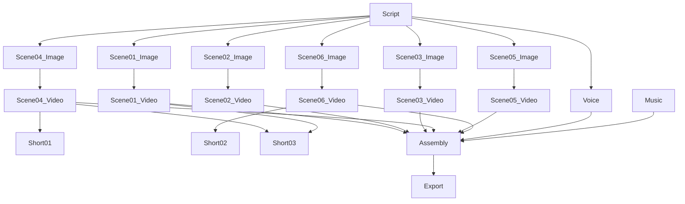

# AI DIRECTOR
## AI Creative Workstation — Project-Level Intelligence

---

## The AI Director Concept

The AI Director is the flagship feature that elevates Canvas from a "creative tool" to a "creative production system."

Its role is analogous to a film director: it understands the creative brief, decomposes it into a production plan, coordinates the execution of each component, and maintains creative consistency across the whole production — while allowing the creator to step in and modify any element.

**Critical note:** The AI Director is explicitly a V2 feature. It requires the Creative Asset Graph, the Job System, and robust multi-modal generation as prerequisites. This document designs it thoroughly so the architecture supports it from day one — but it should not ship in MVP.

---

## What the AI Director Does

```
Creative Brief (from user)
         ↓
  [AI Director: Planning Phase]
  ├── Parse creative intent
  ├── Identify required components
  ├── Determine asset dependencies
  ├── Estimate time and resources
  ├── Select execution providers
  └── Generate production plan
         ↓
  Production Plan (shown to user)
         ↓
  [User Approval / Modification]
         ↓
  [AI Director: Execution Phase]
  ├── Schedule jobs in dependency order
  ├── Monitor progress
  ├── Handle failures gracefully
  ├── Maintain cross-scene consistency
  └── Assemble final output
         ↓
  Creative Production (editable, exportable)
```

---

## Planning Phase in Detail

### Input: Creative Brief

The user provides a natural language brief. No forms, no structured templates required:

> "Create a 7-minute YouTube video about the MacBook Pro M4 Max. I'm the host. Dark cinematic style. Include a thumbnail and 3 Shorts."

### AI Director: Intent Parsing

The AI Director (powered by a local or cloud LLM) parses:

```
extracted_intent = {
  type: "youtube_video",
  topic: "MacBook Pro M4 Max review",
  duration_minutes: 7,
  host: "Marcus" (resolved from character library),
  visual_style: "dark cinematic",
  outputs: ["main_video", "thumbnail", "shorts×3"],
  tone: "informative, professional"
}
```

### AI Director: Production Plan Generation

The director generates a structured production plan:

```
PRODUCTION PLAN
MacBook Pro M4 Max — YouTube Review
Estimated total time: 55 minutes

PHASE 1: Pre-production (parallel, 5 min)
├── Script                    LLM, local, ~2 min
│   └── 7-minute review script, 6 sections
├── Shot list                 LLM, local, ~1 min
└── Style brief               Auto from: Dark-Cinematic style

PHASE 2: Asset preparation (parallel, 8 min)
├── Voice synthesis           TTS, local, ~5 min
│   └── Using: Marcus voice profile
├── Music selection           Music gen, cloud, ~3 min
└── MacBook 3D reference      Existing asset ✓

PHASE 3: Scene generation (sequential + parallel, 35 min)
├── Scene 01: Intro                        [12s video]
│   ├── Image: Marcus + dramatic backdrop  Local, 30s
│   └── Video: Image-to-video              Cloud, 4 min
├── Scene 02: Unboxing                     [18s video]
│   ├── Image: MacBook Pro on table        Local, 30s
│   └── Video                             Cloud, 5 min
├── Scene 03: Design deep-dive             [35s video]
│   ├── Image: Closeup details             Local, 30s
│   └── Video                             Cloud, 6 min
├── Scene 04: Performance                  [40s video]
│   ├── Image: Marcus + coding scene       Local, 30s
│   └── Video                             Cloud, 8 min
├── Scene 05: Competitors                  [30s video]
│   ├── Image: Comparison layout           Local, 25s
│   └── Video                             Cloud, 5 min
└── Scene 06: Verdict                      [15s video]
    ├── Image: Marcus with product         Local, 25s
    └── Video                             Cloud, 3 min

PHASE 4: Packaging (parallel, 7 min)
├── Thumbnail: 3 variants                  Local, 2 min
├── Short 01: From Scene 04               ~30s edit, 1 min
├── Short 02: From Scene 06               ~30s edit, 1 min
└── Short 03: Compiled highlights         ~45s edit, 2 min

PHASE 5: Final assembly (3 min)
└── Main video: All scenes + voice + music
```

---

## Production Plan UX

The production plan is shown to the user as an **interactive Gantt-like view**, not a technical diagram:

```
┌────────────────────────────────────────────────────────────────┐
│  MacBook Pro Review — Production Plan                          │
│  ─────────────────────────────────────────────────────────── │
│  Estimated: 55 minutes  |  Cloud cost: ~$1.20 credits         │
│                                                                │
│  Script         ████ done                                      │
│  Voice          ████████ 5 min                                 │
│  Scene 01       ░░░░████████ 4.5 min                           │
│  Scene 02       ░░░░████████████ 5.5 min                       │
│  Scene 03       ░░░░░░░░████████████ 6.5 min                   │
│  Scene 04       ░░░░░░░░░░░░████████████████ 8.5 min           │
│  Scene 05       ░░░░░░░░████████████ 5.5 min                   │
│  Scene 06       ░░░░░░░░░░░░░░░░████████ 3.5 min               │
│  Thumbnails     ░░░░░░░░░░░░░░░░░░░░░░████ 2 min               │
│  Shorts         ░░░░░░░░░░░░░░░░░░░░░░░░████ 3 min             │
│  Assembly       ░░░░░░░░░░░░░░░░░░░░░░░░░░░░████ 3 min         │
│                                                                │
│  [ Edit plan ]  [ Approve & Start ]                            │
└────────────────────────────────────────────────────────────────┘
```

---

## Execution Phase in Detail

### Dependency Resolution

The AI Director builds a dependency DAG before execution:



**Rules:**
- Nodes with no dependencies run first (and in parallel where possible)
- A node only starts when all its dependencies are complete
- Failure of one node triggers a failure handling strategy (see below)

---

### Partial Regeneration

This is the critical capability that makes AI Director useful rather than just a batch generator.

**Scenario:** User wants to change Scene 4 after all scenes are generated.

```
User: "Make Scene 4 more cinematic and replace the background with a mountain landscape"
        ↓
AI Director evaluates:
  - Does changing Scene 4 affect any other scene? → Check dependency graph
  - Scene 4 feeds into: Short01, Short03, Assembly
  - Short01 and Short03 use Scene 4's video clip
  - Assembly uses Scene 4's video clip
        ↓
Dependency impact report shown to user:
  ┌─────────────────────────────────────────┐
  │  Regenerating Scene 4 will affect:      │
  │  • Short 01 — will be re-cut            │
  │  • Short 03 — highlight clip will change│
  │  • Final video — Scene 4 segment        │
  │                                         │
  │  Scenes 1, 2, 3, 5, 6 — unchanged ✓    │
  │                                         │
  │  [ Regenerate Scene 4 ]  [ Cancel ]     │
  └─────────────────────────────────────────┘
        ↓
Regeneration plan:
  1. Regenerate Scene 4 image (new prompt)
  2. Regenerate Scene 4 video
  3. Re-cut Short 01 with new Scene 4 clip
  4. Re-cut Short 03 with new Scene 4 highlight
  5. Reassemble final video with updated Scene 4
  
  Estimated: 12 minutes
```

---

### Creative Consistency Mechanism

The AI Director maintains consistency across scenes through a **consistency context**:

```json
{
  "consistency_context": {
    "host": {
      "asset_id": "char_marcus",
      "identity_strength": 0.85,
      "position": "typically right-frame or center"
    },
    "product": {
      "asset_id": "prod_macbook_pro_m4",
      "3d_reference": "macbook_pro_m4.glb",
      "placement": "prominently visible"
    },
    "visual_style": {
      "asset_id": "style_dark_cinematic",
      "color_palette": "desaturated with blue-teal accent",
      "lighting": "dramatic directional",
      "depth_of_field": "medium"
    },
    "scene_transitions": "smooth, cinematic",
    "camera_language": "wide establishing → medium close-up"
  }
}
```

This context is injected into every scene's generation prompt automatically. Users don't see it — they just experience consistent results.

---

## AI Director Failure Handling

Production jobs can fail. The AI Director must handle this gracefully:

| Failure Type | Handling |
|---|---|
| Cloud provider timeout | Retry 2× with backoff; offer local fallback if capable |
| Local VRAM exceeded | Auto-route to cloud; notify user |
| Model produces unusable result | Detect quality issues; offer regeneration with adjusted settings |
| Dependency chain failure | Mark downstream jobs as blocked; show user which part failed; offer targeted retry |
| Network failure mid-production | Save all completed work; resume when network returns |
| User-cancelled job | Preserve completed work; allow resumption |

**UX for failures:**
```
Scene 03 failed to generate.

The video model timed out on cloud.

[ Retry Scene 03 ]  [ Use lighter model ]  [ Skip Scene 03 ]
```

---

## AI Director Limitations (Honest)

**What AI Director can do well at V2:**
- Script → scenes decomposition with LLM
- Dependency-ordered job scheduling
- Consistent asset injection across scenes
- Partial regeneration with dependency tracking
- Progress tracking and resumption

**What AI Director cannot do reliably at V2:**
- Perfect visual consistency between scenes without human review
- Automatic quality gating (deciding if a generation is "good enough")
- Truly creative decision-making (it follows the brief, doesn't innovate)
- Real-time collaboration between team members on the same production
- Audio-visual synchronization with frame-perfect timing

**Honest position:** The AI Director is a powerful production assistant, not an autonomous director. The creator remains in control of creative decisions. The Director handles logistics and coordination.
